# 实验一

## 实验环境

`Ubuntu 20.04 Server 64bit`

`CentOS  7.7`

## 实验问题

### 调查并记录实验环境的如下信息：

#### 当前 `Linux` 发行版基本信息

`lsb_release -a`

#### 当前 `Linux` 内核版本信息

`uname -r`

### `Virtualbox` 安装完 `Ubuntu` 之后新添加的网卡如何实现系统开机自动启用和自动获取 `IP`？

新建网卡，设置网络连接方式为`Host-Only`

`ifconfig -a`

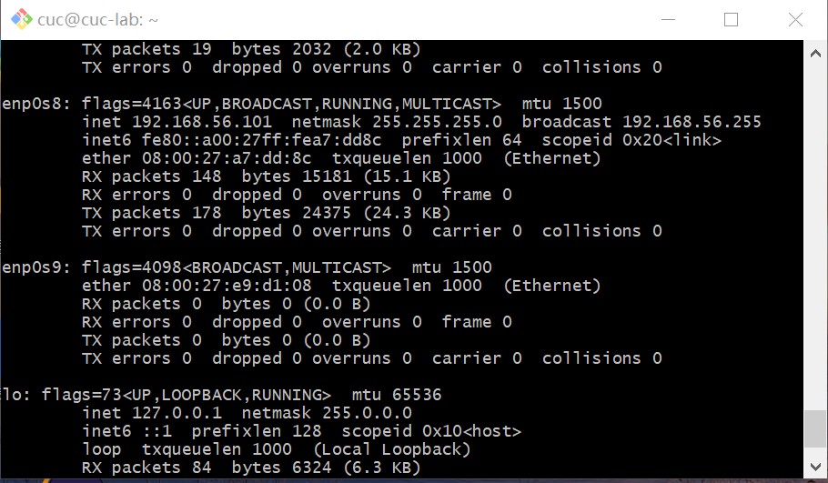

`ifconfig`

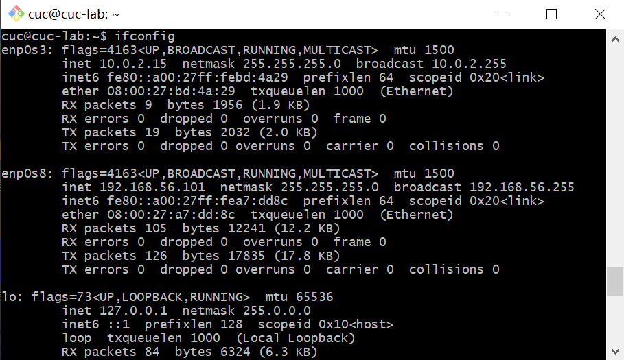

查看网络信息

`sudo vim /etc/netplan/00-installer-config.yaml`

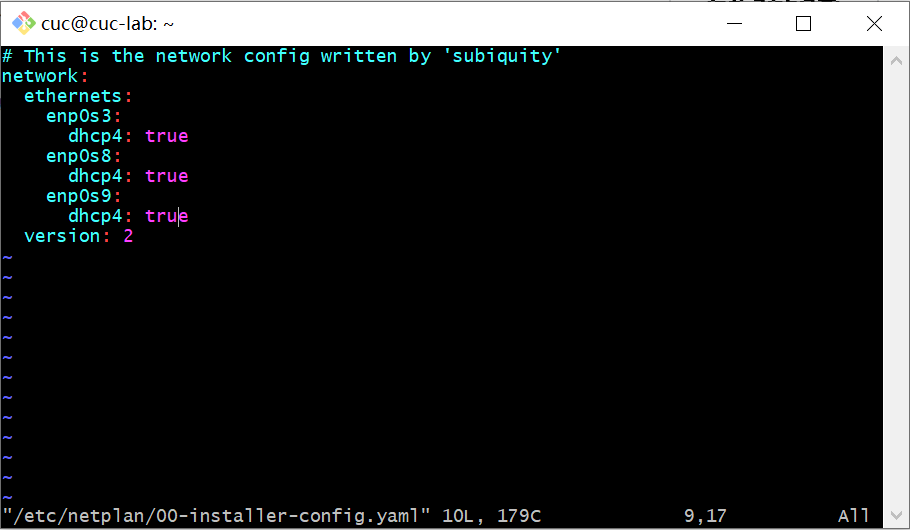

`sudo netplan apply`

`ifconfig`验证

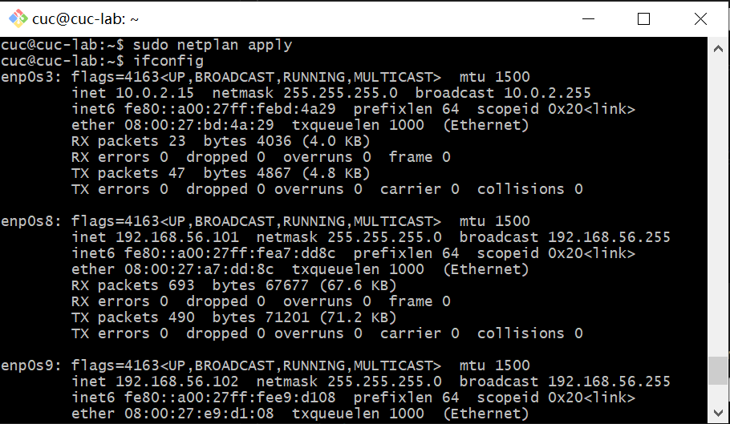

### 如何使用 `scp` 在「虚拟机和宿主机之间」、「本机和远程 `Linux` 系统之间」传输文件？

#### 「虚拟机和宿主机之间」

##### 宿主机发送到虚拟机

新建`test.txt`文件

发送

`scp C:\Users\249115381521\Desktop/test.txt cuc@192.168.56.101:/home/cuc`

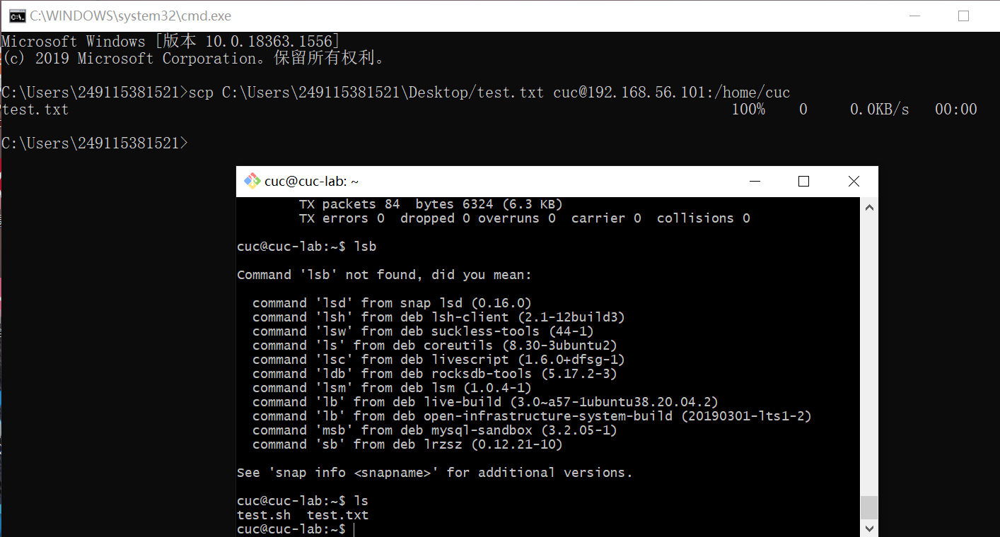

##### 虚拟机发送到宿主机

`cat test.txt`查看要发送的文件

`vim test.txt`修改并保存

`scp cuc@192.168.56.101:/home/cuc/test.txt ./`发送

桌面删除原文件，避免歧义

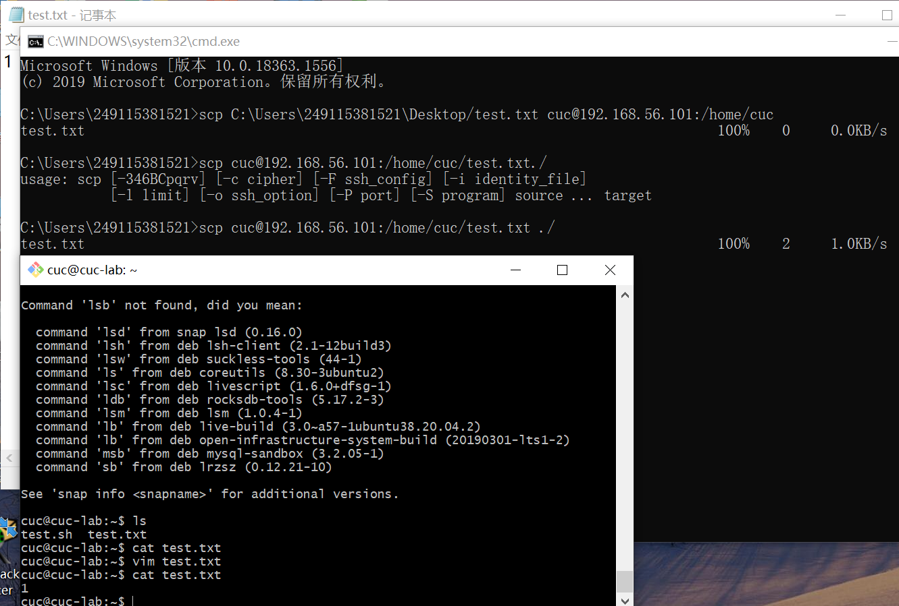

#### 「本机和远程 `Linux` 系统之间」

##### 本机发送到云端

连接并发送

`scp C:\Users\249115381521\Desktop\text.txt root@101.133.135.63:/root`

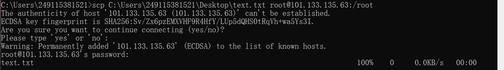

验证

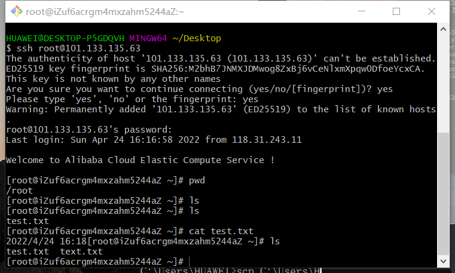

##### 云端发送到本机

连接并发送

`scp root@101.133.135.63:/root/test.txt ./`

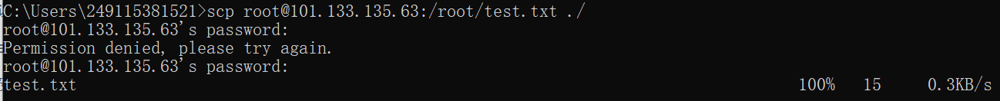

验证

### 如何配置 `SSH` 免密登录？

`ssh-kegen -b 4096`生成密钥

`scp C:/Users/249115381521/.ssh/id_rsa.pub cuc@192.168.56.101:~/.ssh` 复制ssh文件到虚拟机

`cp id_rsa.pub authorized_keys`将公钥复制为`authorized_keys`文件

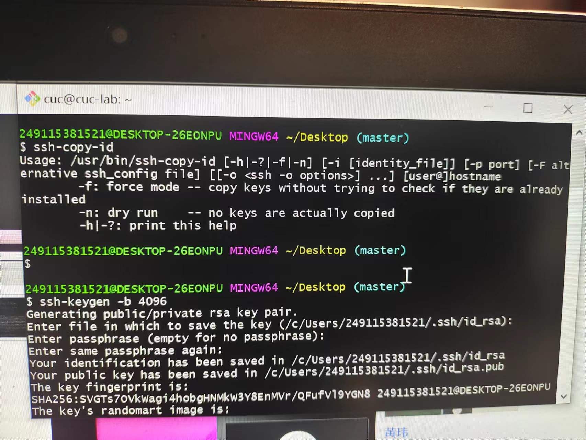

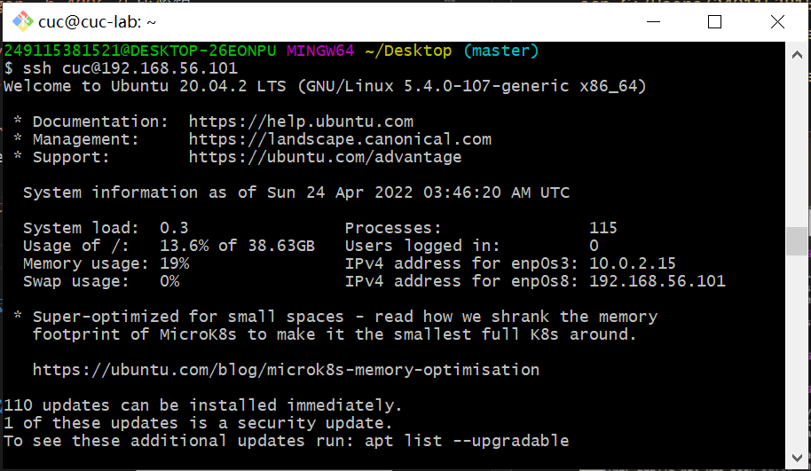

## 实验反思

1，"#"越少，标题越大

2，英文框在``里

3，写一句空一行

4，命令行错一次输入都不行，不过还是不知道如何用tab

5，图片命名要解释清楚在干啥，如果是文件夹里命名不能有汉字，空格，特殊符号，需要分隔用"_"，图片格式用小写png

6，一步一解释，一步一截图

7，一次查阅一次文献记录

8，虚拟机关了才能新建网卡

9，有些操作需要验证，要拍验证的操作

10，无论是云端或者虚拟机往本机发文件还是本机发给云端或者虚拟机，都在本机操作

## 参考文档

[`linux`查看系统信息](https://it.51dongshi.com/esgedfrrshdhr.html)

[`Linux` 内核版本信息](https://it.51dongshi.com/esgedfrrdcgbh.html)

[新建网卡并自启和获取IP](https://blog.csdn.net/xiongyangg/article/details/110206220)

[`vim`用法](https://mp.weixin.qq.com/s?src=11&timestamp=1650776688&ver=3757&signature=tRilT1ehoWuFbdDZC8*WQvn*-yFVCNOCWGMOXjk0EQvEpzrmlTjv-Ssuh6eoCBtbtknwyF3JJ3vXurw-DE3jS6jQ2UqboAm4uLY8jRhISkj8stD818J2RD-H7gWANJrG&new=1)

[`scp`用法](https://www.runoob.com/linux/linux-comm-scp.html)

[`scp`具体用法](http://courses.cuc.edu.cn/course/82669/forum#/topics/219985?show_sidebar=false&scrollTo=topic-219985&pageIndex=1&pageCount=1&topicIds=220990,219985,219877&predicate=lastUpdatedDate&reverse)

[ssh免密登录](https://blog.csdn.net/pengjunlee/article/details/80919833)

[ssh用法](https://it.51dongshi.com/esgedfrsdesas.html)