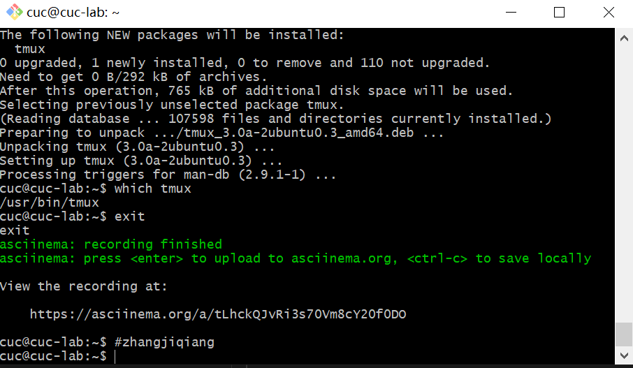
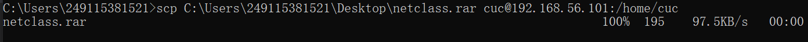
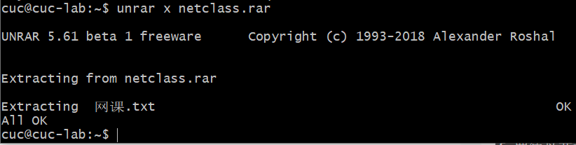
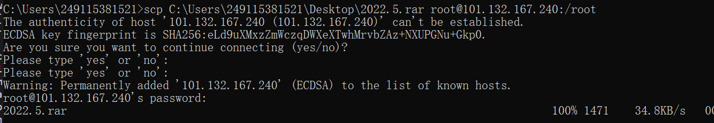

# 实验环境

## 当前课程推荐的 `Linux` 发行版本

### 本地环境（`Ubuntu 20.04`）

### 云环境（`CentOS 7.7`）

## 在`asciinema`注册一个账号，并在本地安装配置好`asciinema`

## 确保本地已经完成`asciinema auth`，并在`asciinema`成功关联了本地账号和在线账号

### 本地

```
sudo apt-add-repository ppa:zanchey/asciinema
sudo apt-get update
sudo apt-get install asciinema
```


### 云端

`yum install asciinema`

## 在自己的`github`仓库上新建`markdown`格式纯文本文件附上`asciinema`的分享URL

## 提醒 避免在终端操作录像过程中暴漏密码、个人隐私等任何机密数据

# 实验问题

## 使用表格方式记录至少2个不同`Linux`发行版本上以下信息的获取方法，使用`asciinema`录屏方式「分段」记录相关信息的获取过程和结果

|                    |         Ubuntu 20.04         |        `CentOS`  7.7         |
| ------------------ | :--------------------------: | :--------------------------: |
| 安装               |   sudo apt-get install ...   |      yum -y install ...      |
| 查看路径/验证卸载  |          which ...           |          which ...           |
| 卸载               |   sudo apt-get remove ...    |      yum -y remove ...       |
| 按特殊文件名查找   |  sudo find ./ -name "*...*"  |    find ./ -name "*...*"     |
| 按特殊文件内容查找 |     sudo grep -r "..." *     |       grep -r "..." *        |
| 压缩与解压缩       |         具体查看实例         |         具体查看实例         |
| CPU                |      cat /proc/cpuinfo       |      cat /proc/cpuinfo       |
| 内存               | cat /proc/meminfo \| free -m | cat /proc/meminfo \| free -m |
| 硬盘大小和硬盘数量 |        lsblk \| df -h        |        lsblk\| df -h         |


## 【软件包管理】在目标发行版上安装`tmux`和`tshark`；查看这 2 个软件被安装到哪些路径；卸载`tshark`；验证`tshark`卸载结果

### 本地

#### `tmux`

```
sudo apt-get update
sudo apt-get install tmux
which tmux
```

[](https://asciinema.org/a/tLhckQJvRi3s70Vm8cY20f0DO)



#### `tshark`

```
sudo apt-get update
sudo apt-get install tshark
which tshark
sudo apt-get remove tshark
which tshark
```

[](https://asciinema.org/a/vk2AjIl0bItCZV9EArPURKpzJ)

### 云端

#### `tmux`

#### `tshark`

```
yum install tmux wireshark
which tmux tshark
yum remove wireshark
which tshark
```

[](https://asciinema.org/a/X7Zvnfr4bcO4015oKeTsGhpB3)

## 【文件管理】复制以下`shell` 代码到终端运行，在目标`Linux` 发行版系统中构造测试数据集，然后回答以下问题：

`cd /tmp && for i in $(seq 0 1024);do dir="test-$RANDOM";mkdir "$dir";echo "$RANDOM" > "$dir/$dir-$RANDOM";done`

### 找到`/tmp`目录及其所有子目录下，文件名包含 666 的所有文件

### 找到`/tmp`目录及其所有子目录下，文件内容包含 666 的所有文件

#### 本地

```
sudo find ./ -name "*666*"
sudo grep -r "666" *
```

[](https://asciinema.org/a/4cc1W3Fz6mVrwGGm5jdUanEF8)

#### 云端

```
find ./ -name "*666*"
grep -r "666" *
```

 [](https://asciinema.org/a/2Ir1OR9Cyysw27JvqOAYYDQB3)

## 【文件压缩与解压缩】练习课件中 文件压缩与解压缩 一节所有提到的压缩与解压缩命令的使用方法

### 本地

#### gzip

```
gzip test.txt
gzip -d test.txt.gz
```

[](https://asciinema.org/a/lqHBbbPXMvZTYBoRUPSvdHJbh)

#### bzip2

```
bzip2 test.txt
bzip2 -d test.txt.bz2
```

[](https://asciinema.org/a/sI6qguanUz4EgqsZwkUDYyZ6k)

#### zip

```
zip test.zip test.txt
unzip test.zip
```

[](https://asciinema.org/a/mtPEftj5TlhKjxPPYuF7zpptW)

#### tar

```
tar -jcvf test.tar.bz2 test.txt
tar -jxvf test.tar.bz2
```

[](https://asciinema.org/a/Z6hPI52SjAcmlM6gOvXSY8Dt0)

#### 7z (p7zip)

```
sudo apt install p7zip-full
7za a test.7z /home/cuc/*
7za l test.7z
7za x test.7z
```

[](https://asciinema.org/a/XE0wa7LHcydP28od2DAjZCdwP)

#### rar (p7zip-rar / unrar-free)

本机向虚拟机传送一个压缩文件

`scp C:\Users\249115381521\Desktop\netclass.rar cuc@192.168.56.101:/home/cuc`



安装`unrar`

`sudo apt-get install unrar`

解压

`unrar x netclass.rar`



### 云端

#### gzip

```
gzip test.txt
gzip -d test.txt.gz
```

[](https://asciinema.org/a/adTaLIQFNJDLwKvhmB39HsGzG)

#### bzip2

```
bzip2 test.txt
bzip2 -d test.txt.bz2
```

[](https://asciinema.org/a/cvFFxhSTTw3cm0ko9kzF66PL9)

#### zip

```
zip test.zip test.txt
unzip test.zip
```

[](https://asciinema.org/a/tOUlv1Tj29rCuTE6sD61fp8Gk)

#### tar

```
tar -jcvf test.tar.bz2 test.txt
tar -jxvf test.tar.bz2
```

[](https://asciinema.org/a/zWUi9N9Rcezf2VfSmcLuDMFFz)

#### 7z (p7zip)

```
yum -y install p7zip
7za a test.7z/root/*
7za l test.7z
7za x test.7z
```

[](https://asciinema.org/a/sjh4R0ytMYIwvgUATHOYXo9za)

#### rar (p7zip-rar / unrar-free)

本机向云端传送一个压缩文件

`scp C:\Users\249115381521\Desktop\2022.5.rar root@101.132.167.240:/root`



安装`unrar`

```
wget --no-check-certificate http://www.rarlab.com/rar/rarlinux-x64-5.5.0.tar.gz
tar -xzvf rarlinux-x64-5.5.0.tar.gz
cd rar
make
mkdir -p /usr/local/rar
cp rar unrar /usr/local/rar
cp rar unrar /usr/local/bin
```

解压

`unrar x 2022.5.rar`

[](https://asciinema.org/a/Y259ORHQn2lC8mSn9BiqeZMQV)

## 【跟练】 子进程管理实验

[](https://asciinema.org/a/MCwqNBPAA7kGaiHOJSmAkpfJa)

## 【硬件信息获取】目标系统的 `CPU`、内存大小、硬盘数量与硬盘容量

### 本地

#### `CPU`

`cat /proc/cpuinfo`

#### 内存大小

`cat /proc/meminfo`

`free -m`

#### 硬盘数量与硬盘容量

`lsblk`

`df -h`

[](https://asciinema.org/a/Ls73Lbdc8bt8ICjQtvUYwhqWb)

### 云端

#### `CPU`

`cat /proc/cpuinfo`

#### 内存大小

`cat /proc/meminfo`

`free -m`

#### 硬盘数量与硬盘容量

`lsblk`

`df -h`

[](https://asciinema.org/a/rHj64mTIDFsp2zw2CbCDX6v11)

# 实验反思

1,空格，“-”，“——”互相有很严谨的区别

2，“-”后面的是命令参数，参数在不引起歧义时可以同时写多个

3，有些操作可以同时对多个对象操作(`rm`删除，`which`查找)

4，当有命令找不到时，尝试安装对应的包，当确认操作输入无问题后还是和预想情况不同时，尝试卸载(`remove`)并重新安装(`install`)

5，完整的文件名包括文件名和文件格式

6，无论是云端或者虚拟机往本机发文件还是本机发给云端或者虚拟机，都在本机操作

7，`vim` ：输入`i`进入编辑模式，按`esc`退出编辑模式，输入`:wq`退出编辑器

# 参考文献

[卸载软件](https://www.jianshu.com/p/ec4a999fd1cb)

[查找软件路径](https://www.linuxdiyf.com/linux/20318.html)

[文件内容查找](https://www.cnblogs.com/savokiss/p/3938987.html)

[压缩与解压缩](https://zhuanlan.zhihu.com/p/152623706)

[删除文件](https://it.51dongshi.com/esgedfrrdacva.html)

[7zip安装使用](https://www.jianshu.com/p/d04c618af8ca)

[查看cpu信息](https://it.51dongshi.com/esgedfrrsadae.html)

[查看内存信息](https://it.51dongshi.com/esgedfrrevvra.html)

[查看硬盘信息](http://www.680.com/it/1909/ito-155417.html)

[云端安装`asciinema`](https://www.cnblogs.com/wucongzhou/p/12579440.html)