# 实验三

## 实验环境

`Ubuntu 20.04`

## 实验内容

`Systemd` 入门教程：命令篇 `by` 阮一峰的网络日志

`systemctl --version`

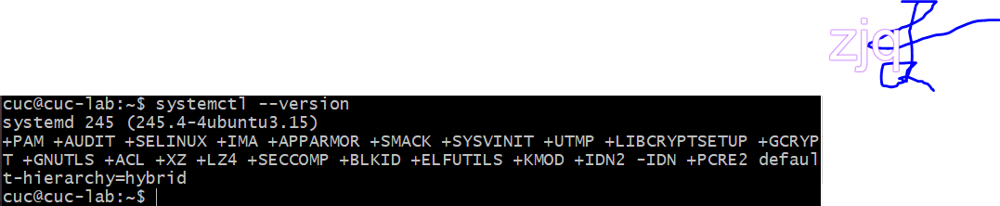

```
systemd-analyze                                   
systemd-analyze blame
systemd-analyze critical-chain
systemd-analyze critical-chain atd.service
```

[](https://asciinema.org/a/NGQgj60WAcnBVc1iCwPwqg8A6)

```
hostnamectl
sudo hostnamectl set-hostname rhe17
hostnamectl
sudo hostnamectl set-hostname cuc-lab
```

[](https://asciinema.org/a/osu7vjMuXYRWhDCE34ByBehTg)

```
localectl
sudo localectl set-locale LANG=en_GB.utf8
sudo localectl set-keymap en_GB
```

[](https://asciinema.org/a/dlYs6DWNCW28CX19TqcPzpYxp)

```
timedatectl
timedatectl list-timezones
sudo timedatectl set-timezone America/New_York
sudo timedatectl set-time YYYY-MM-DD
sudo timedatectl set-time HH:MM:SS
```

[](https://asciinema.org/a/SitPQeJBvI46h0bsRAWRFnYCT)

```
loginctl list-sessions
loginctl list-users
loginctl show-user ruanyf
```

[](https://asciinema.org/a/zUVVE1vrYvJjeMhPkqDXPg73u)

```
systemctl list-units
systemctl list-units --all
systemctl list-units --all --state=inactive
systemctl list-units --failed
systemctl list-units --type=service
```

[](https://asciinema.org/a/dTglKxBJ8fICKMNZpahQGiCjy)

```
systemctl status
sysystemctl status bluetooth.service
systemctl -H root@rhel7.example.com status httpd.service
```

[](https://asciinema.org/a/QUbmyg96u3ql3H8MNvxuy5thA)

```
systemctl is-active application.service
systemctl is-failed application.service
systemctl is-enabled application.service
```

[](https://asciinema.org/a/5nf5dlW4U3X2gpzVdRe6BT9VN)

```
sudo systemctl start apache2.service
sudo systemctl stop apache2.service
sudo systemctl restart apache2.service
sudo systemctl kill apache2.service
sudo systemctl reload apache2.service
sudo systemctl daemon-reload
systemctl show httpd.service
systemctl show -p CPUShares httpd.service
sudo systemctl set-property httpd.service CPUShares=500
```

[](https://asciinema.org/a/ByT1uiRonDnX3xHQHE7FzmP85)

```
systemctl list-dependencies nginx.service
systemctl list-dependencies --all nginx.service
```


```
sudo systemctl enable clamd@scan.service
sudo systemctl disable clamd@scan.service
```

[](https://asciinema.org/a/T39rPvgOglT6vILx9bJtvb27d)

```
systemctl list-unit-files
systemctl list-unit-files --type=service
```

[](https://asciinema.org/a/CNYZOtr8X9d9ftaIaWxIAhZlG)

`systemctl cat atd.service`

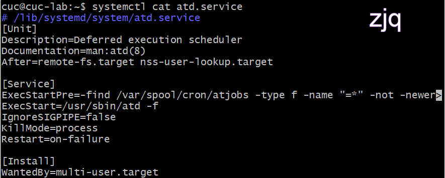

```
systemctl list-unit-files --type=target
systemctl list-dependencies multi-user.target
systemctl get-default
sudo systemctl set-default multi-user.target
sudo systemctl isolate multi-user.target
```

[](https://asciinema.org/a/h0ivbJVxbtnIjfrjbq4KeMbSM)

```
sudo journalctl
sudo journalctl -k
sudo journalctl -b
sudo journalctl -b -0
sudo journalctl -b -1
sudo journalctl --since="2012-10-30 18:17:16"
sudo journalctl --since "20 min ago"
sudo journalctl --since yesterday
sudo journalctl --since "2015-01-10" --until "2015-01-11 03:00"
sudo journalctl --since 09:00 --until "1 hour ago"
sudo journalctl -n
sudo journalctl -n 20
sudo journalctl -f
sudo journalctl /usr/lib/systemd/systemd
sudo journalctl _PID=1
sudo journalctl /usr/bin/bash
sudo journalctl _UID=33 --since today
sudo journalctl -u nginx.service
sudo journalctl -u nginx.service --since today
sudo journalctl -u nginx.service -f
journalctl -u nginx.service -u php-fpm.service --since today
sudo journalctl -p err -b
sudo journalctl --no-pager
sudo journalctl -b -u nginx.service -o json
 sudo journalctl -b -u nginx.serviceqq
 -o json-pretty
sudo journalctl --disk-usage
sudo journalctl --vacuum-size=1G
sudo journalctl --vacuum-time=1years
```

[](https://asciinema.org/a/BbIxImYCbvMgzm2T0iVR5w6xp)

`Systemd` 入门教程：实战篇 `by` 阮一峰的网络日志

[](https://asciinema.org/a/PAN2hfVbxMhZV77ZCNL7fTYfF)

参照第2章作业的要求，完整实验操作过程通过`asciinema`进行录像并上传，文档通过github上传

如何添加一个用户并使其具备`sudo`执行程序的权限？

```
sudo adduser queen
cat /etc/passwd
sudo usermod -G sudo queen
groups queen
```

[](https://asciinema.org/a/MaYCj3ITj6O25jwJjRnRR9n9J)

如何将一个用户添加到一个用户组？

```
sudo groupadd card
sudo usermod -G card queen
groups queen
```

[](https://asciinema.org/a/Emt7Wa9Xsg9YavMiFfN5rezO0)

如何查看当前系统的分区表和文件系统详细信息？

`fdisk -l`

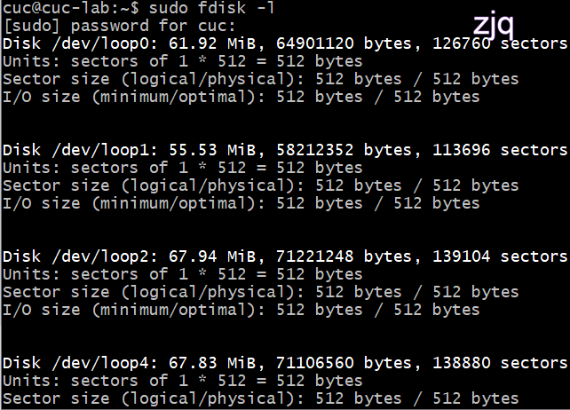

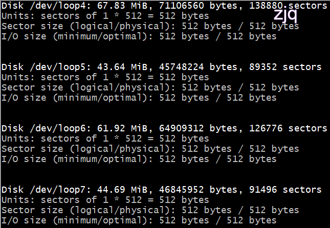

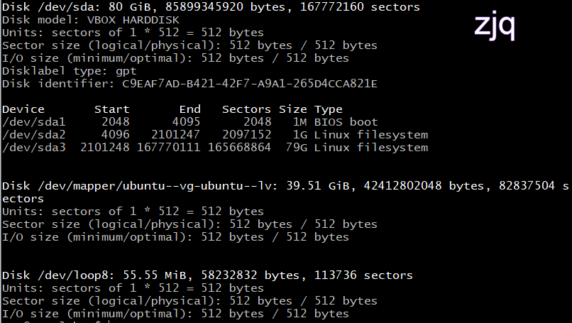

如何实现开机自动挂载`Virtualbox`的共享目录分区？

`windows`创建一个文件夹

设置>共享文件夹>配置共享文件夹路径

新建`Ubuntu`共享文件夹

```
sudo mkdir /mnt/share
sudo mount -t vboxsf linux-share /mnt/share/
```

实现开机自动挂载

`sudo vim /etc/fstab`

在文件末尾添加：

`linux-share /mnt/share/ vboxsf defaults 0 0`

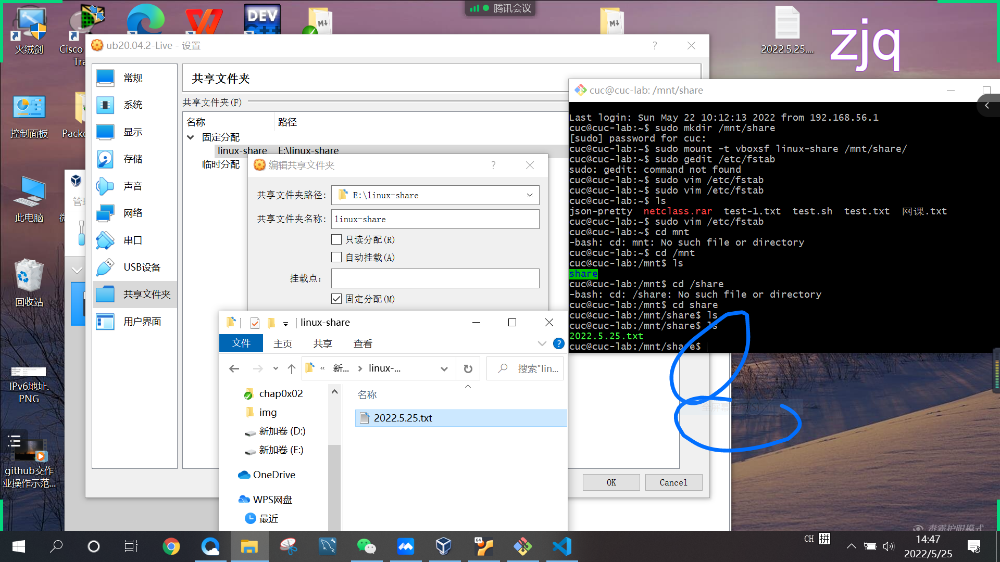

基于`LVM`（逻辑分卷管理）的分区如何实现动态扩容和缩减容量？

添加硬盘

`lsblk`查看添加效果

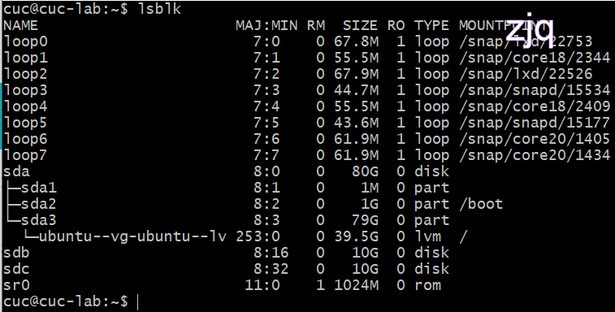

写入磁盘

`sudo fdisk /dev/sdb`sdc同理

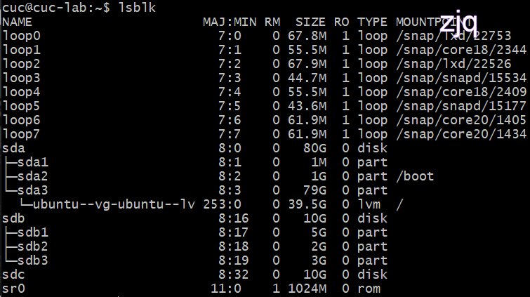

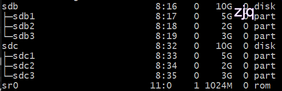

挂载硬盘

```
sudo mkdir -p /mnt/sdc3
sudo mount /dev/sdc3 /mnt/sdc3
```

sdb1,sdb2,sdb3,dc1,sdc2同理

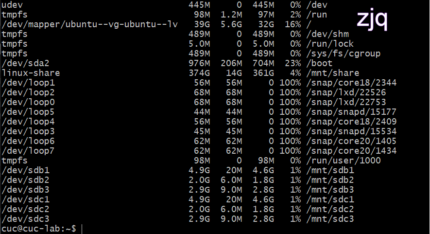

`vgcreate`

```
umount /dev/sdb3
pvcreate /dev/sdb{1,2,3}
```

sdb1,sdb2,sdb3,dc1,sdc2同理

```
vgcreate demo-vg /dev/sdb{1,2,3}
vgextend demo-vg /dev/sdc{1,2,3}
```

查看结果

`pvs`


分区

```
lvcreate -L 10G -n demo-lv-1 demo-vg
lvcreate -l 100%FREE -n demo-lv-2 demo-vg
mkfs.ext4 /dev/demo-vg/demo-lv-1
mkdir /mnt/demo-lv-1
mount /dev/demo-vg/demo-lv-1 /mnt/demo-lv-1
```

`demo-lv-2`同理

查看结果

`vgs`,`vgdisplay`,`vgscan`
`lv`同理

扩容1G
```
lvextend -L +1G /dev/demo-vg/demo-lv-1
lvscan
```

减容1G
```
lvreduce -L -1G /dev/demo-vg/demo-lv-1
lvscan
```

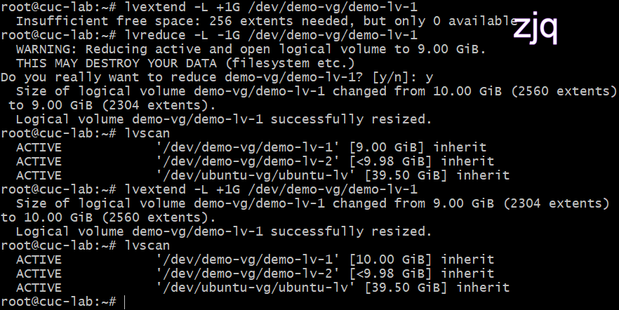

如何通过`systemd`设置实现在网络连通时运行一个指定脚本，在网络断开时运行另一个脚本？

不会

如何通过`systemd`设置实现一个脚本在任何情况下被杀死之后会立即重新启动？实现杀不死

```
[service]

Restart=always

sudo systemctl daemon-reload

sudo systemctl restart XXXXX
```

## 实验问题
1,`sudo su -`进入管理员模式

2，`--since 09:00 --until "1 hour ago"`,这指当前虚拟机时间的前一个小时

3，路径也可容易作为参数，命令和参数之间要加空格

4，`I`,`l`,1是有区别的

5，当有些操作打不出来时，尝试用文本的形式写出，再复制粘贴到命令行窗口

## 参考文献

[时间同步](http://www.jdccie.com/?p=3987)

[添加用户](https://www.csdn.net/tags/MtjaMg3sMjk4NDctYmxvZwO0O0OO0O0O.html)

[查看用户和用户组](https://www.sogou.com/tx?ie=utf-8&pid=sogou-wsse-7f5a17b792b687fc&query=linux%E5%A6%82%E4%BD%95%E6%9F%A5%E7%9C%8B%E6%96%B0%E7%94%A8%E6%88%B7)

[添加权限](https://blog.csdn.net/breeze5428/article/details/52837768)

[添加组](https://mp.weixin.qq.com/s?src=11&timestamp=1653211552&ver=3814&signature=3yBs2FjtKAg5IHd-BWwI21husZ2M2JE8r5BMJm7TrgiKw4biOuM*D5Vez6jYIvASd2yngLZi1W-x9-id3onPBtEzVPZuOOuyzeW3OHOiWPOSGF5z4NsGHp5NtPbPFKyx&new=1)

[将用户添加到用户组](https://it.51dongshi.com/esgedfrrsrrdv.html)

[共享文件夹](https://blog.csdn.net/hexf9632/article/details/93774198)