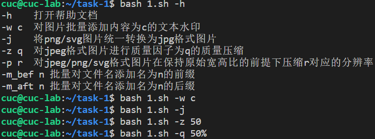
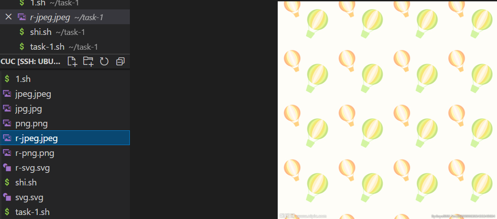
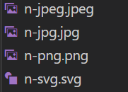
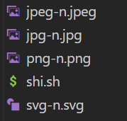
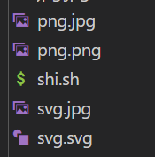

# 实验四

## 实验环境

`ubuntu 20.04`

## 实验内容

### 任务一：用bash编写一个图片批处理脚本，实现以下功能

- [x] 支持命令行参数方式使用不同功能
- [x] 支持对指定目录下所有支持格式的图片文件进行批处理
- [x] 支持以下常见图片批处理功能的单独使用或组合使用
- [x] 支持对jpeg格式图片进行图片质量压缩
- [x] 支持对jpeg/png/svg格式图片在保持原始宽高比的前提下压缩分辨率
- [x] 支持对图片批量添加自定义文本水印
- [x] 支持批量重命名（统一添加文件名前缀或后缀，不影响原始文件扩展名）
- [x] 支持将png/svg图片统一转换为jpg格式图片

### 任务二：用bash编写一个文本批处理脚本，对以下附件分别进行批量处理完成相应的数据统计任务

2014世界杯运动员数据

- [x] 统计不同年龄区间范围（20岁以下、[20-30]、30岁以上）的球员数量、百分比
- [x] 统计不同场上位置的球员数量、百分比
- [x] 名字最长的球员是谁？名字最短的球员是谁？
- [x] 年龄最大的球员是谁？年龄最小的球员是谁？

### 任务三：用bash编写一个文本批处理脚本，对以下附件分别进行批量处理完成相应的数据统计任务

Web服务器访问日志

- [x] 统计访问来源主机TOP 100和分别对应出现的总次数
- [x] 统计访问来源主机TOP 100 IP和分别对应出现的总次数
- [x] 统计最频繁被访问的URL TOP 100
- [x] 统计不同响应状态码的出现次数和对应百分比
- [x] 分别统计不同4XX状态码对应的TOP 10 URL和对应出现的总次数
- [x] 给定URL输出TOP 100访问来源主机

## 实验过程

### 任务一

支持命令行参数方式使用不同功能

支持对jpeg格式图片进行图片质量压缩

支持对jpeg/png/svg格式图片在保持原始宽高比的前提下压缩分辨率

支持对图片批量添加自定义文本水印

支持批量重命名（统一添加文件名前缀或后缀，不影响原始文件扩展名）

前缀：

后缀：

支持将png/svg图片统一转换为jpg格式图片

### 任务二

### 任务三

## 实验反思

1,连接之前要先开电脑

2,host不包括版本号

3,函数格式：function 函数名 {}，输出格式：echo ""

4,帮助手册是让别人看的,有什么参数要说明功能

5,脚本文件扩展名是.sh

6,写代码步骤：新建测试文件>简单操作>逐步复杂>搬回原脚本

7,“*”代表所有的，后缀不标明默认指路径下所有文件

8,批处理格式：for 计数变量名 in 操作对象集合

9,调试脚本要在对应目录下面,而且要每改变一次都保存一次

10,参数对应变量名

11,排错或者测试的时候可以先对个体实验

12,删除多个文件时会一起删除当前文件，多备份以防万一

13,while[ "$1"!="" ]中，""内不要加空格，"[" 后和 "]"前要加空格

14,将脚本文件迁移至本地时，可以先新建一个脚本文件，用Vscode打开，再复制粘贴

15,注意大小写，例如任务二中"Age"写成"age"是不会被识别的

16,do,done搭配，BEGIN,END搭配

17,很多时候试错都可以从拼写，缺少空格，复制粘贴之后少改某些对应项入手

## 参考文献

[循环结构](https://www.jb51.net/LINUXjishu/335617.html)

[质量压缩](https://blog.csdn.net/songwenbinasdf/article/details/51205480)

[分辨率压缩](https://blog.csdn.net/Rylan11/article/details/76850667?locationNum=9&fps=1)

[添加水印](https://www.yuanchengzhushou.cn/article/8147.html)

[格式转换](https://zhidao.baidu.com/question/1887472566651363908)

[文件重命名](https://www.cnblogs.com/MineGi/p/12165446.html)

[awk用法](https://blog.csdn.net/wdz306ling/article/details/80383824)

[sort排序](https://blog.51cto.com/lspgyy/1282334)
